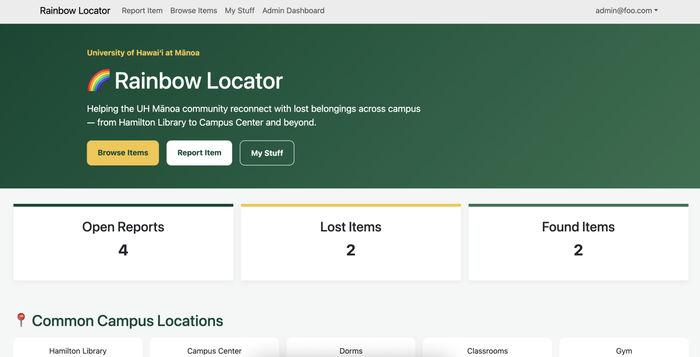
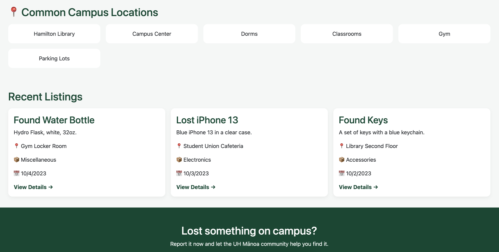
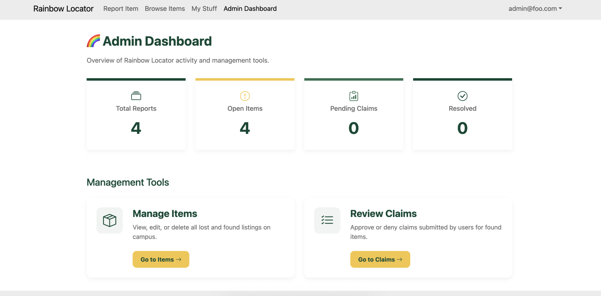
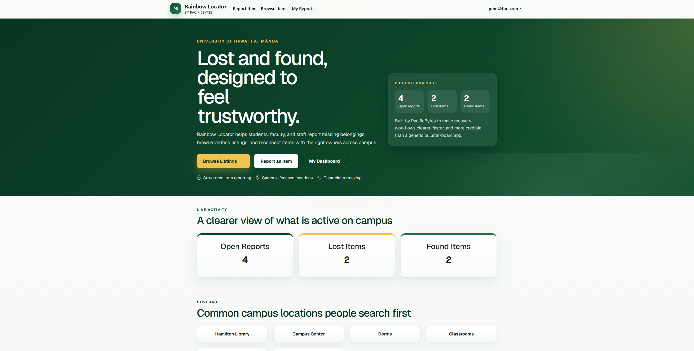
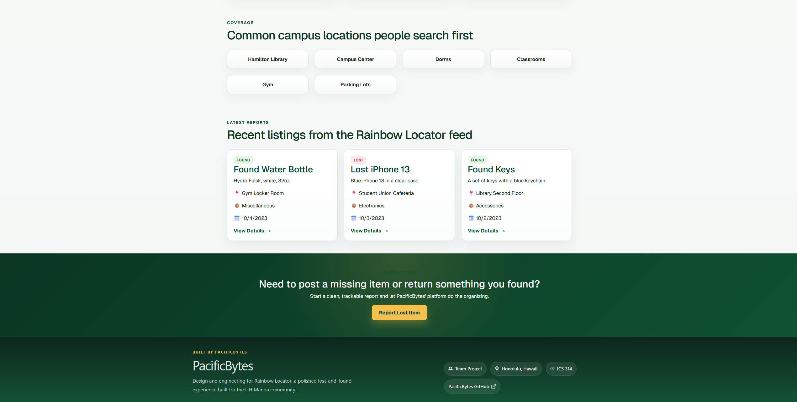
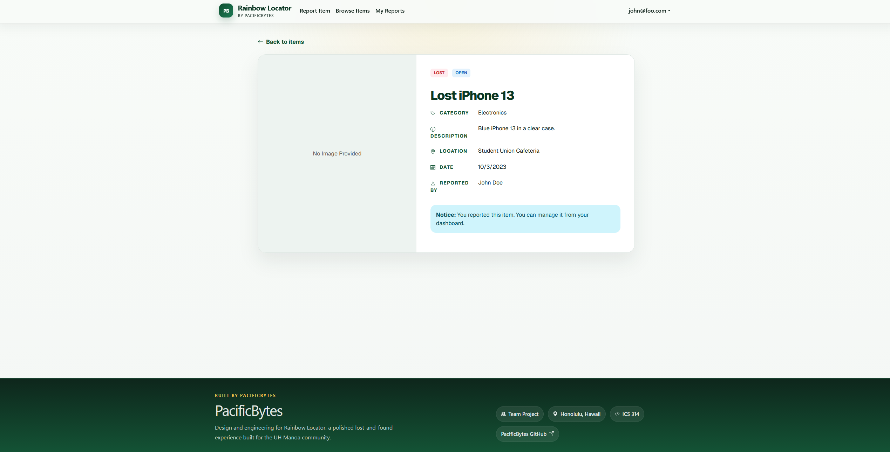
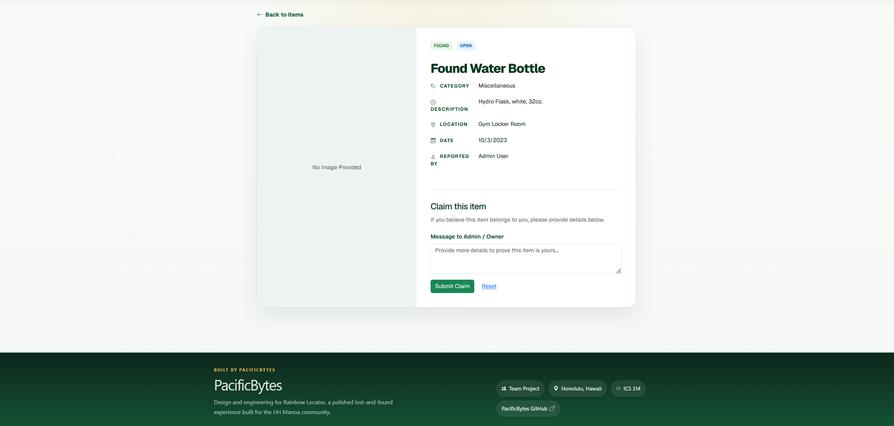
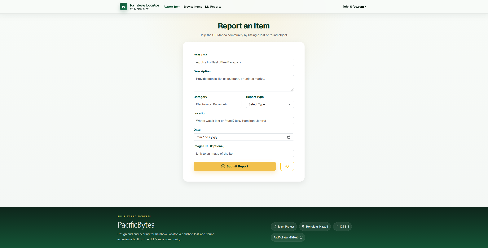

# Rainbow Locator 

Welcome to Rainbow Locator!

## Links
- [Organization](https://github.com/orgs/pacificbytes/repositories)
- [Team Contract](https://docs.google.com/document/d/1jPyax2KjJcxirhOlvrwQXVIuoQ-Braw6GKhe-Pn-XDw/edit?usp=sharing)
- [Deployment](https://rainbowlocator.vercel.app/)
- [Rainbow Locator Repository](https://github.com/pacificbytes/rainbow-locator)
- [Deployment](https://rainbow-locator.vercel.app)
- [Source Code](https://github.com/pacificbytes/pacificbytes.github.io)

## Project Overview
We’ve all been there—you’re rushing across campus, get to your next spot, and realize your keys,
wallet, or favorite hydroflask is gone. It’s a total nightmare trying to retrace your steps, and half
the time, if someone actually finds your stuff, they have no clue where to take it. Physical
lost-and-found bins are usually just "black holes" where items sit for months, and scrolling through
random social media posts to find a lost item is a shot in the dark.

## Proposed Solution
Rainbow Locator is a simple, digital hub designed to get lost items back to its rightful owners.
Instead of hoping for the best, this platform gives the community a central place to post what they’ve
found or search for what they’ve lost. By putting everything in one searchable database with photos
and locations, we’re making it way easier for someone to say, "Hey, that’s mine!" and actually get it
back.

**Users**
Regular users can quickly jump on and report an item they found or post about something they're
missing. If you spot your lost item in the feed, you can "Claim" it by sending a message to prove it’s
yours. There’s also a "My Reports" page so you can keep track of your reports and see if your claims
have been approved without any guesswork.

**Admins**
Admins are there to keep the community honest and the site clean. They have a bird's-eye view of all
the items and claims coming through. They review the messages people send to claim items, hit
"approve" or "deny" to make sure things go to the right person, and clear out old or resolved posts so
the list stays up to date.

The system will eventually provide:
- **~~User Authentication~~** 
- **~~Report Found Items~~**
- **~~Admin Dashboard~~**
- **User Profile**
- **Search and Filter System**

## Team Members
- Hans Beuren Rambayon
- Za'Niyah Smith
- Raeanna Vance

## Mockup Pages | [Milestone 1](https://github.com/orgs/pacificbytes/projects/1)

### Landing Page

### Admin Dashboard

### Browse Items Page

### My Stuff/My Reports

## Mockup Pages | [Milestone 2](https://github.com/orgs/pacificbytes/projects/2)

### New Landing Page

### Browse Items Details
Submitted Item

Claiming an Item

### New Item Creation
